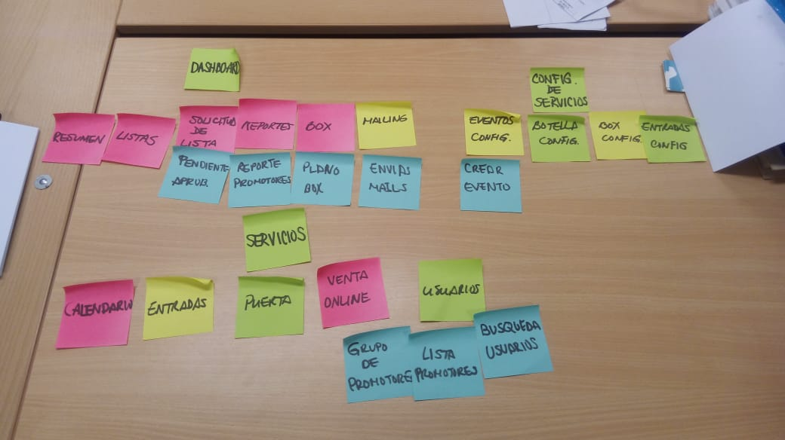
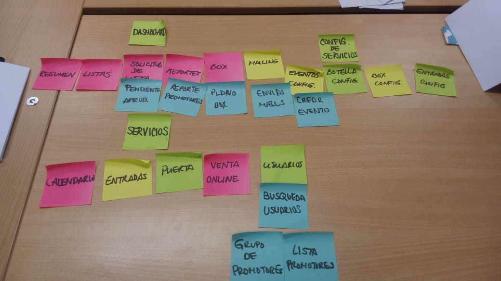
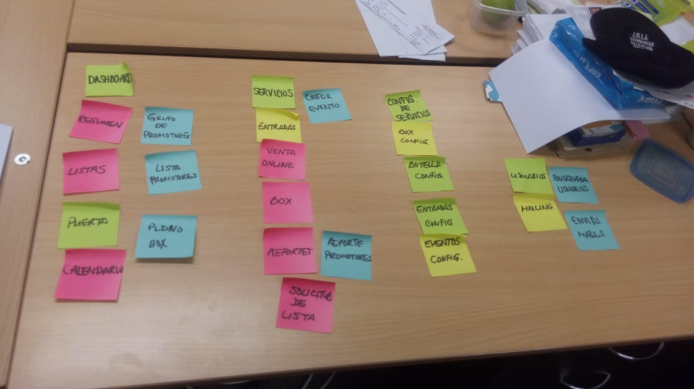
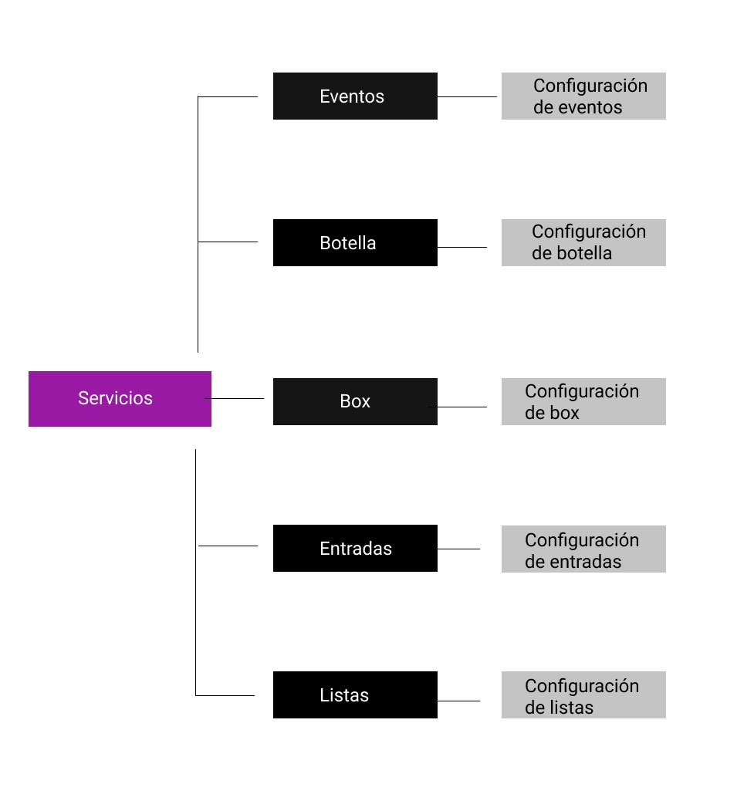
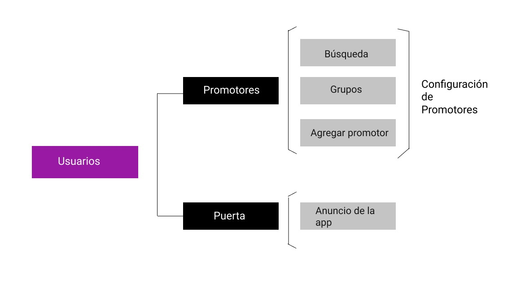
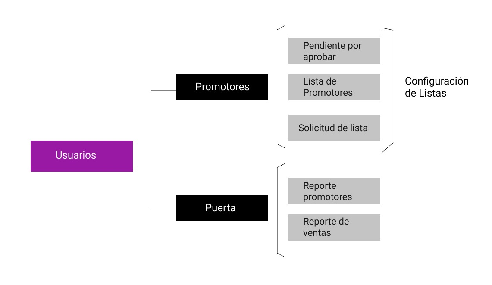
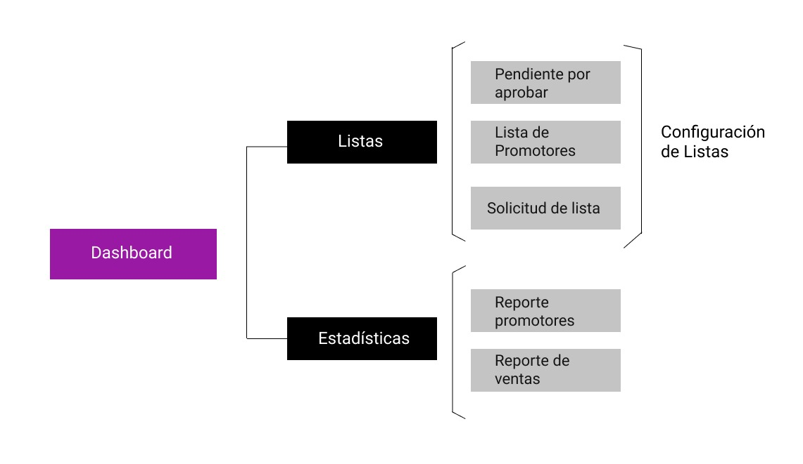
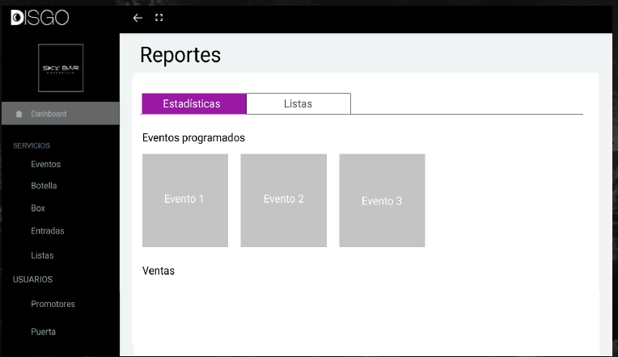
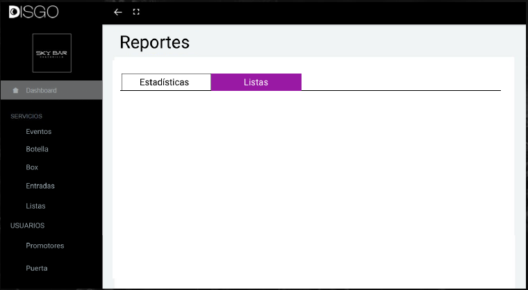

# DISGO 2.0 Challenge: Arquitectura de la Información

## EL RETO

Los clientes no entienden las funcionalidades de la aplicación de negocios de Disgo. En consecuencia, Disgo tiene que capacitar a sus usuarios presencialmente.

## OBSERVACIONES

### Revisión de la App Web

* Algunas funcionalidades se repiten en diferentes secciones, con diferentes nombres.

* Los títulos de las secciones no son intuitivas.

## ETAPAS DEL PROCESO Y HERRAMIENTAS

* Para saber que está fallando en la app web de Disgo, primero lo estudiamos.

* Aplicamos la herramienta de card sorting con algunos clientes actuales de la app web.

* Ideación de nueva organización por categorías.

* Para encontrar cuál es el esquema mental de las personas al organizar un evvento, hicimos un estudio de Card Sorting con Optimal Workshop.

* Luego de haber obtenido la información necesaria, se realizó un esquema de los resultados.

## CARD SORTING

## ESQUEMA

## PROTOTIPO

## Realizado por:

* Alexandra Calderón
* Shannon Rivera